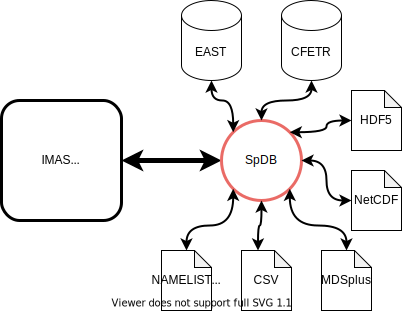

# SpDB
=======

**SpDB** is a data integration tool designed to organize scientific data from different sources under the same namespace according to a global schema and to provide access to them in a unified form (views). Its **main purpose** is to provide a unified data access interface for complex scientific computations in order to enable the interaction and integration between different programs and databases.

